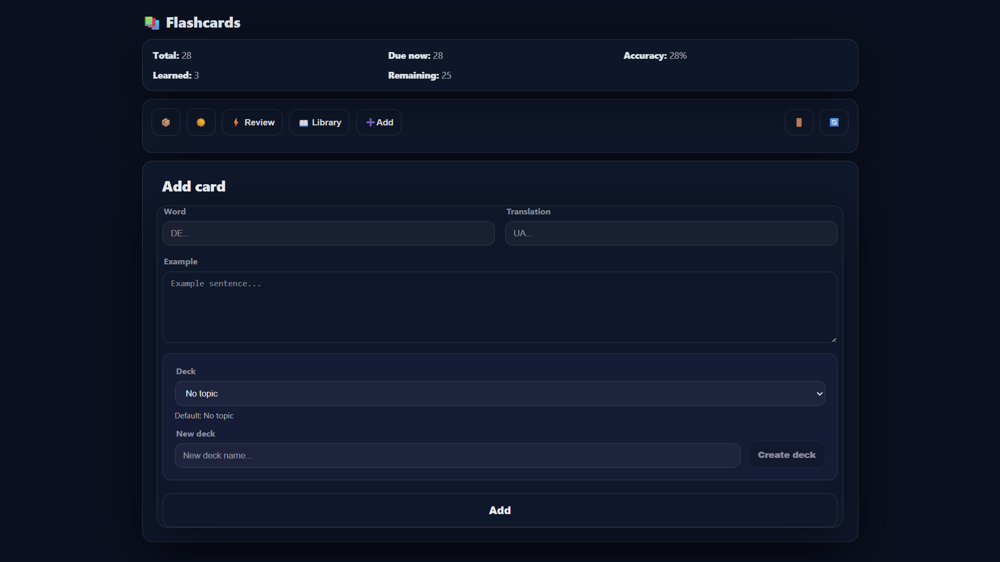
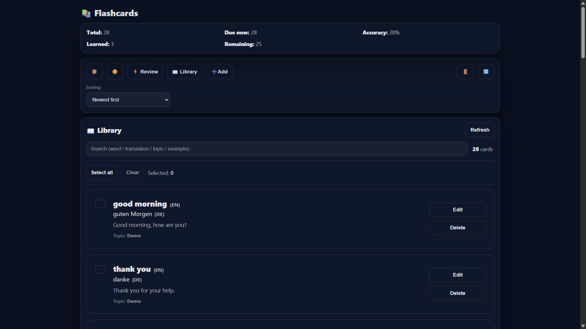
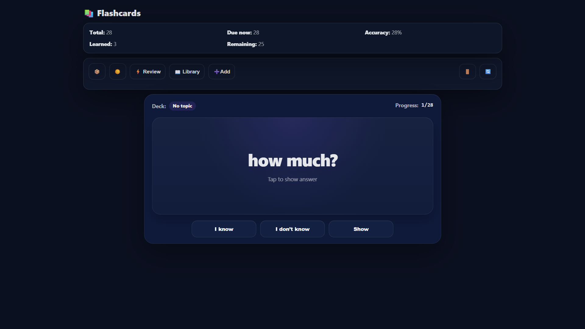

# Flashcards — Spaced Repetition Vocabulary App

Modern full-stack flashcards web application for vocabulary learning with interval-based spaced repetition and progress tracking.

Built with React, Node.js, Express, and MongoDB.

---

## Live Demo

🚀 Frontend:  
https://cards-6rxm.onrender.com

🛠️ Backend API:  
https://cards-api-a10o.onrender.com

▶️ Demo Video:  
https://github.com/BohdanBedrynets/cards/releases/tag/v1.0.0

⬇️ MP4 Download:  
https://github.com/BohdanBedrynets/cards/releases/download/v1.0.0/Cards.video.mp4

---

## Demo Account

```txt
Email: demo@demo.com
Password: demo12345
```

---

## Features

### Learning System
- Spaced repetition review system
- Flip cards interaction
- Known / Unknown answer tracking
- Automatic next review scheduling

### Card Management
- Create, edit, and delete flashcards
- Search and sorting system
- Vocabulary library management
- Category organization

### Import / Export
- JSON export/import
- CSV export/import

### User Experience
- Responsive design
- Dark / Light theme
- Multilanguage UI (DE / EN / UK)
- Statistics dashboard

### Backend & Security
- JWT authentication
- REST API
- MongoDB database
- Protected routes

---

## Tech Stack

### Frontend
- React
- Vite
- JavaScript
- CSS3

### Backend
- Node.js
- Express.js
- MongoDB
- JWT Authentication

---

## Local Setup

Open **two terminals**.

---

### 1. Backend

```bash
cd server
npm install
node index
```

Create `server/.env`

```env
MONGO_URI=your_mongodb_connection_string
JWT_SECRET=your_secret
PORT=5000
```

Backend runs on:

```txt
http://localhost:5000
```

---

### 2. Frontend

```bash
cd client
npm install
npm run dev
```

(Optional) Create `client/.env`

```env
VITE_API_URL=http://localhost:5000
```

Frontend runs on:

```txt
http://localhost:5173
```

---

## Screenshots

### Deck Manager


### Library


### Review Mode


---

## Author

Bohdan Bedrynets

GitHub:  
https://github.com/BohdanBedrynets